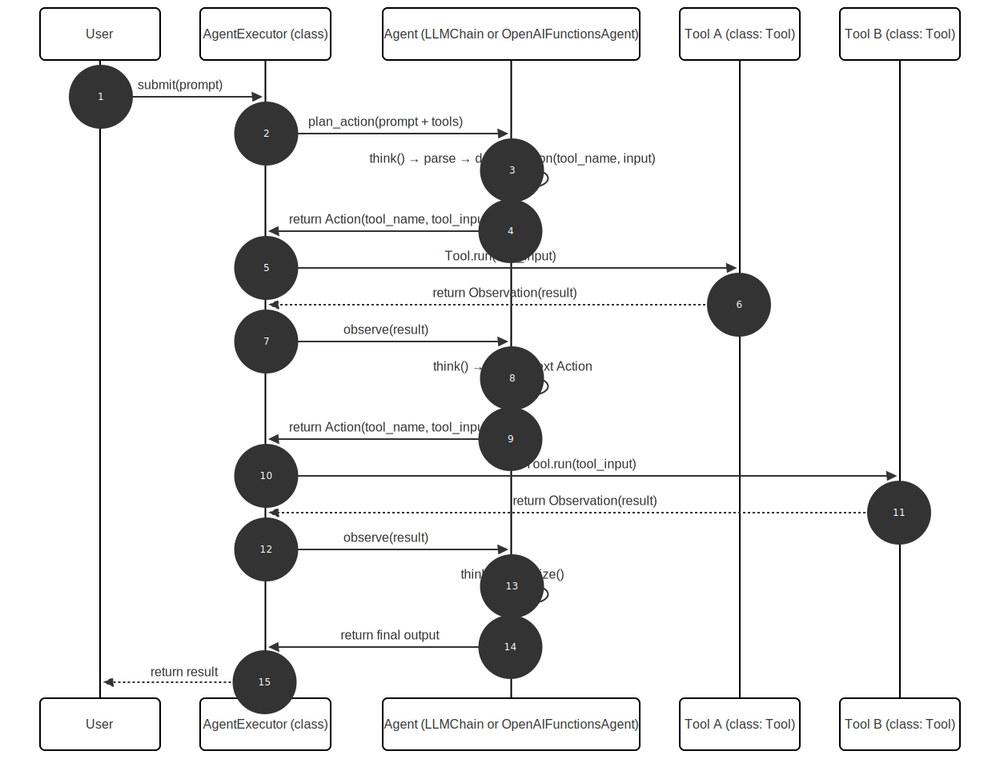

# LangChain Agent Generic Sequence Diagram 



# LangChain Agent Interfaces – Modular Agent Execution Use Case

This project demonstrates key LangChain **agent interface implementations**, each in its own self-contained Python script. The use case focuses on **modular execution of tool-based agents**, enabling intelligent, structured task routing and orchestration via LLM-powered agents.

---

## 🧠 Use Case Overview

**Goal:** Automatically route user requests to the right tools (e.g., search, math, translation), leveraging LangChain's agent architecture:
- Single-tool deterministic invocation
- Parallel multi-tool execution
- Clean abstraction of agent logic from tool definitions

Each agent interface script showcases a different control mechanism for how the agent interacts with tools, allowing tailored reasoning and response behavior.

---

## 🗂️ Agent Interface Scripts

| Script | Interface | Purpose |
|--------|-----------|---------|
| `1_agent_single_action.py` | `LLMSingleActionAgent` | Performs a single, LLM-directed tool invocation per user prompt. Good for straightforward decision points. |
| `2_agent_multi_action.py`  | `BaseMultiActionAgent`  | Executes **multiple tool calls in parallel** based on the same input. Ideal for batched or forked reasoning. |

---

## 🚀 How to Run

1. Install dependencies:
   ```bash
   pip install langchain openai

